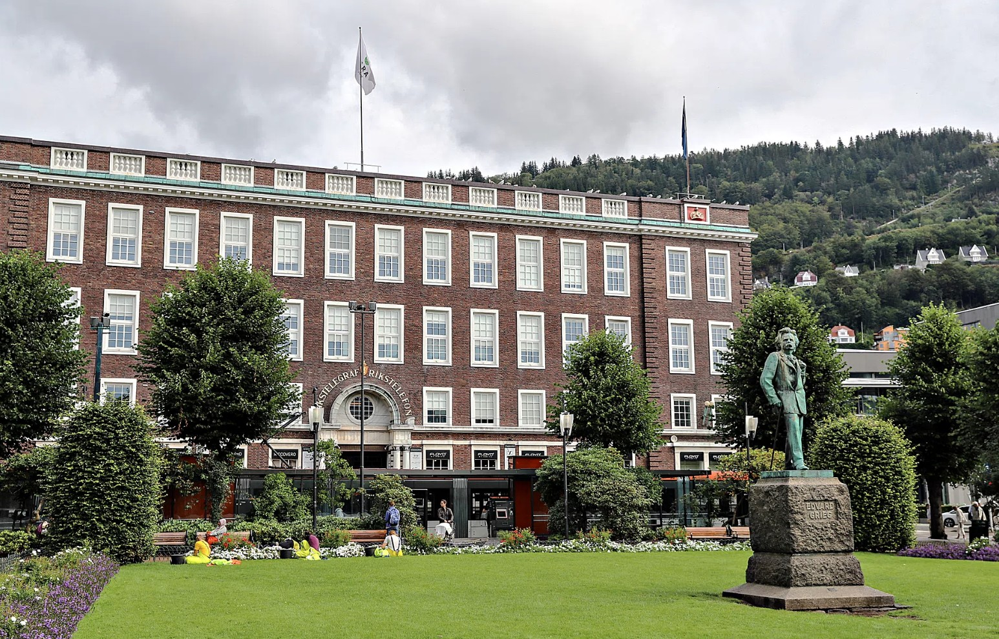

<link rel="stylesheet" href="SPWM%20mal/colors_and_type.css">
<style>
  .dm-doc { font-family: var(--font-sans); color: var(--sp-navy); line-height: 1.55; max-width: 920px; }
  .dm-doc h1, .dm-doc h2, .dm-doc h3, .dm-doc h4 { font-family: var(--font-display); font-weight: 500; color: var(--sp-navy); letter-spacing: -0.01em; }
  .dm-doc code, .dm-doc pre { font-family: ui-monospace, SFMono-Regular, Menlo, Consolas, monospace; font-size: 0.9em; }
  .dm-swatch-row { display: flex; flex-wrap: wrap; gap: 12px; margin: 16px 0 28px; }
  .dm-swatch { width: 132px; border-radius: 12px; border: 1px solid rgba(0,0,0,.06); overflow: hidden; background: #fff; }
  .dm-swatch .chip { height: 72px; }
  .dm-swatch .meta { padding: 10px 12px; font-size: 12px; color: var(--gray-700); }
  .dm-swatch .meta strong { display: block; font-size: 13px; color: var(--sp-navy); font-weight: 600; }
  .dm-logo-grid { display: grid; grid-template-columns: 1fr; gap: 20px; margin: 20px 0 32px; }
  .dm-logo-card { border: 1px solid var(--gray-200); border-radius: 12px; overflow: hidden; background: #fff; }
  .dm-logo-card .stage { padding: 36px 28px; display: flex; align-items: center; justify-content: center; min-height: 110px; }
  .dm-logo-card .stage img { max-width: 100%; height: auto; }
  .dm-logo-card .caption { padding: 14px 18px; border-top: 1px solid var(--gray-200); background: var(--gray-25); font-size: 13px; color: var(--gray-600); }
  .dm-logo-card .caption strong { color: var(--sp-navy); display: block; font-size: 14px; margin-bottom: 4px; }
  .dm-type-specimen { border: 1px solid var(--gray-200); border-radius: 12px; padding: 28px 32px; margin: 16px 0 28px; background: #fff; }
  .dm-italic { font-family: var(--font-italic); font-style: italic; }
  .dm-table { width: 100%; border-collapse: collapse; font-size: 14px; margin: 12px 0 28px; }
  .dm-table th, .dm-table td { border-bottom: 1px solid var(--gray-200); padding: 10px 12px; text-align: left; vertical-align: top; }
  .dm-table th { font-size: 12px; text-transform: uppercase; letter-spacing: .04em; color: var(--gray-500); font-weight: 600; }
  .dm-callout { border-left: 3px solid var(--blue-main); background: var(--blue-50); padding: 14px 18px; border-radius: 0 8px 8px 0; margin: 16px 0 24px; font-size: 14px; color: var(--gray-700); }
  .dm-do { color: var(--success-700); } .dm-dont { color: var(--error-700); }
  .dm-shadow-box { width: 88px; height: 88px; background: #fff; border-radius: 12px; display: inline-block; }
  .dm-radius-box { width: 70px; height: 70px; background: var(--blue-100); border: 1.5px solid var(--blue-main); display: inline-block; }
  .dm-photo-row { display: flex; flex-wrap: wrap; gap: 24px; align-items: flex-start; margin: 20px 0 28px; }
  .dm-photo-hero { border: 1px solid var(--gray-200); border-radius: 12px; overflow: hidden; background: #0a0a0a; max-width: 320px; }
  .dm-photo-hero.wide { max-width: 100%; background: #fff; }
  .dm-photo-hero.wide img { width: 100%; max-height: 420px; object-fit: cover; object-position: center; }
  .dm-photo-hero img { display: block; width: 100%; height: auto; }
  .dm-photo-hero .caption { padding: 14px 16px; background: var(--gray-25); border-top: 1px solid var(--gray-200); font-size: 13px; color: var(--gray-600); }
  .dm-photo-hero .caption strong { display: block; color: var(--sp-navy); font-size: 14px; margin-bottom: 4px; }
  .dm-photo-avatar { width: 96px; height: 96px; border-radius: 100px; object-fit: cover; object-position: center 20%; border: 2px solid var(--gray-200); }
  .dm-photo-card { display: flex; gap: 16px; align-items: center; background: #fff; border: 1px solid var(--gray-200); border-radius: 12px; padding: 20px; max-width: 360px; }
</style>

<div class="dm-doc">

# Designmal — Söderberg & Partners Wealth Management

**Versjon:** 1.0 · **Språk:** Norsk (bokmål) · **Kilde:** `Designsystem.fig` + prosjektets brand-assets, tokens og UI-kit

Dette dokumentet er den autoritative designmalen for **Söderberg & Partners Wealth Management**-klientportalen. Den samler merkevare, fotografi (portrett + kontor), typografi, farger, spacing, komponenter, layout, ikonografi, innholdstonalitet og asset-katalog basert på filene i dette prosjektet.

<div class="dm-callout">
<strong>Produktsammendrag.</strong> En eksklusiv, moderne og rolig digital klientportal for formuesforvaltning. Visuelt uttrykk: nordisk institusjonell fintech — luftig, tilbakeholden, tillitsvekkende. Navy er blekk; blå er handling. Ingen emoji, ingen dekorative gradienter på flater.
</div>

---

## Innholdsfortegnelse

1. [Merkevare og logoer](#1-merkevare-og-logoer)
2. [Fotografi, portretter og kontor](#2-fotografi-portretter-og-kontor)
3. [Typografi](#3-typografi)
4. [Farger](#4-farger)
5. [Spacing, radius og elevasjon](#5-spacing-radius-og-elevasjon)
6. [Layout og app-skall](#6-layout-og-app-skall)
7. [Komponenter](#7-komponenter)
8. [Ikonografi](#8-ikonografi)
9. [Data visualisering](#9-data-visualisering)
10. [Innhold, tone og formatering](#10-innhold-tone-og-formatering)
11. [Interaksjon, tilstand og bevegelse](#11-interaksjon-tilstand-og-bevegelse)
12. [Skjermer og navigasjon](#12-skjermer-og-navigasjon)
13. [Do / Don’t](#13-do--dont)
14. [Asset-katalog og filkart](#14-asset-katalog-og-filkart)
15. [CSS-tokens (referanse)](#15-css-tokens-referanse)

---

## 1. Merkevare og logoer

### 1.1 Merkevarekjerne

| Element | Verdi |
|---|---|
| Selskap | Söderberg & Partners |
| Produktlinje | Wealth Management |
| Signaturfarge | Söderberg navy `#002359` |
| Handlingsfarge | Blue Main `#0A5EDC` |
| Logomark | Symmetrisk «skjell / vifte / blomst»-emblem |
| Wordmark | «söderberg & partners» (to linjer) |
| Deskriptor | «Wealth Management» (to linjer), skilt med tynn vertikal divider |

### 1.2 Logo-regler (ikke-forhandlingsbare)

- Bruk **kun** leverte SVG/PNG-filer — ikke gjenskap wordmark i HTML/CSS.
- **Ikke** strekk, skjev, roter, legg skygge på, eller endre farger utenom godkjente varianter.
- **Clear space** = høyden på wordmarkens cap-height på alle fire sider.
- **Minimumshøyde** for horisontal lockup: ca. **20px**. Desktop-sidebar: **34px**.
- På lys bakgrunn: navy-lockup. På navy/mørk bakgrunn: hvit knockout.
- Logomark alene brukes når plassen er trang (mobil toppbar, favicon, app-ikon).

### 1.3 Alle logoer i prosjektet

#### A. Wealth Management — primær lockup (navy)

Horisontal produkt-lockup: logomark + «söderberg & partners» + divider + «Wealth Management». Farge: `#002359`.

<div class="dm-logo-grid">
  <div class="dm-logo-card">
    <div class="stage" style="background:#FCFCFD;">
      
    </div>
    <div class="caption">
      <strong>spwm-logo.svg</strong>
      Primær produktlogo · `SPWM mal/assets/spwm-logo.svg` · viewBox 210×34 · fyll `#002359`
    </div>
  </div>
</div>

#### B. Wealth Management — hvit knockout

Samme lockup i hvitt for navy/mørke flater (f.eks. login brand-panel).

<div class="dm-logo-grid">
  <div class="dm-logo-card">
    <div class="stage" style="background:#002359;">
      
    </div>
    <div class="caption">
      <strong>spwm-logo-white.svg</strong>
      Knockout · `SPWM mal/assets/spwm-logo-white.svg` · fyll `#FFFFFF` på `--sp-navy`
    </div>
  </div>
</div>

#### C. Logomark — navy og hvit

Isolert emblem for kompakt bruk (mobil, favicon, små flater).

<div class="dm-logo-grid">
  <div class="dm-logo-card">
    <div class="stage" style="background:#FCFCFD; gap:48px;">
      
      <div style="width:1px;height:56px;background:var(--gray-200);"></div>
      <div style="background:#002359;padding:16px 24px;border-radius:8px;">
        
      </div>
    </div>
    <div class="caption">
      <strong>spwm-mark.svg / spwm-mark-white.svg</strong>
      `SPWM mal/assets/` · crop 24×34 · navy `#002359` / hvit `#FFFFFF`
    </div>
  </div>
</div>

#### D. Opplastet kilde-logo

Original brand-asset levert til systemet (horisontal logo, navy).

<div class="dm-logo-grid">
  <div class="dm-logo-card">
    <div class="stage" style="background:#FCFCFD;">
      
    </div>
    <div class="caption">
      <strong>spwm-logo 1.svg</strong>
      Kilde-upload · `SPWM mal/uploads/spwm-logo 1.svg`
    </div>
  </div>
</div>

#### E. Korporativ fargelogo (Designsystem)

Farget logomark (`#008ECC`, `#B3DFEF`, `#002359`) + wordmark i `#161616`. Brukes som korporativ/fullfarge-variant fra Designsystem-mappen — **ikke** som standard i klientportalens UI (portalen bruker monokrom navy/hvit).

<div class="dm-logo-grid">
  <div class="dm-logo-card">
    <div class="stage" style="background:#FFFFFF;">
      
    </div>
    <div class="caption">
      <strong>Logo - Colored.svg</strong>
      `Designsystem/Logo - Colored.svg` · 364×60 · farget mark + sort wordmark
    </div>
  </div>
</div>

#### F. Dark / raster-varianter (Designsystem)

<div class="dm-logo-grid">
  <div class="dm-logo-card">
    <div class="stage" style="background:#000000;">
      
    </div>
    <div class="caption">
      <strong>Logo - Dark.png</strong>
      Full WM-lockup i navy på mørk flate · `Designsystem/Logo - Dark.png`
    </div>
  </div>
  <div class="dm-logo-card">
    <div class="stage" style="background:#000000;">
      
    </div>
    <div class="caption">
      <strong>Logo-mark.png</strong>
      Raster logomark · `Designsystem/Logo-mark.png` · preferer SVG-mark i produksjon
    </div>
  </div>
</div>

### 1.4 Logo-bruk per kontekst

| Kontekst | Asset | Høyde |
|---|---|---|
| Desktop sidebar | `spwm-logo.svg` | 34px |
| Login (mørkt panel) | `spwm-logo-white.svg` | ~42–48px |
| Mobil toppbar | `spwm-mark.svg` | ~28–32px |
| Favicon / app-ikon | `spwm-mark.svg` / `Logo-mark.png` | 16–32px |
| Presentasjon / print | `Logo - Colored.svg` eller navy lockup | etter layout |
| Mørk marketingflate | `spwm-logo-white.svg` eller `Logo - Dark.png` | etter layout |

### 1.5 Clear space & sizing (visuell oppsummering)

| Regel | Verdi |
|---|---|
| Clear space | Cap-height på wordmark, alle sider |
| Desktop nav | 34px høyde |
| Absolutt minimum | 20px høyde |
| Forbudt | Omfarging, stretching, skygge, outline, rotasjon, «Wealth Management» fjernet uten godkjent mark-only variant |

---

## 2. Fotografi, portretter og kontor

### 2.1 Referanseportrett — rådgiver / profil

Profesjonelle portretter brukes i **Rådgiver**-kort, «Din rådgiver», team-/kontaktflater og der en ekte person skal representere rådgivningen. Referansebildet i prosjektet er `Bilde Edv.jpg`.

<div class="dm-photo-row">
  <div class="dm-photo-hero">
    
    <div class="caption">
      <strong>Bilde Edv.jpg</strong>
      Referanseportrett · brystopp · mørk bakgrunn · formell antrekk (navy/charcoal jakke, hvit skjorte, slips)
    </div>
  </div>
  <div>
    <div class="dm-photo-card" style="margin-bottom:16px;">
      
      <div>
        <div style="font-size:12px;color:var(--gray-500);margin-bottom:2px;">Din rådgiver</div>
        <div style="font-size:16px;font-weight:600;color:var(--sp-navy);">Edvard</div>
        <div style="font-size:14px;color:var(--gray-600);margin-top:2px;">Wealth Management</div>
      </div>
    </div>
    <p style="font-size:13px;color:var(--gray-600);max-width:280px;margin:0;">
      Samme bilde cropped til sirkulær avatar (object-fit: cover) i rådgiverkort — radius pill, typisk 64–96px i kort, 40px i kompakte lister.
    </p>
  </div>
</div>

### 2.2 Portrettregler

| Regel | Spec |
|---|---|
| Komposisjon | Bryst-/skulderopp, ansikt litt off-center OK |
| Bakgrunn | Mørk, rolig, høy kontrast (panel/studio) — ikke rotete kontor |
| Lys | Myk frontal/sidebelysning, naturlig hudtone |
| Antrekk | Formelt: mørk jakke, lys skjorte, eventuelt slips — matcher navy-brand |
| Uttrykk | Varm, profesjonell, rolig — aldri «stock smile»-overspill |
| Fargeharmoni | Navy/charcoal + hvitt understøtter `--sp-navy` |
| Filformat | JPG/WebP, god oppløsning (≥800px kortside anbefalt) |
| Bruk i UI | Rådgiverkort, profil, «Book et møte»-kontekst |
| Fallback | Initials-avatar på `--sp-navy` når foto mangler |

### 2.3 Do / Don’t — foto

| Do | Don’t |
|---|---|
| <span class="dm-do">Mørk, rolig bakgrunn som i referansen</span> | <span class="dm-dont">Hvite «passfoto»-bakgrunner eller fargerike miljøer</span> |
| <span class="dm-do">Formell antrekk i navy/mørke toner</span> | <span class="dm-dont">Casual t-skjorte, sportswear, sterke mønstre</span> |
| <span class="dm-do">Crop til sirkel med ansikt i øvre midtre tredjedel</span> | <span class="dm-dont">Stretch, hard filters, duotone, glow</span> |
| <span class="dm-do">Bruk ekte rådgiverfoto der det finnes</span> | <span class="dm-dont">Generiske stock-portretter som kolliderer med merkevaren</span> |

### 2.4 Kontoret — stedsfoto

Kontor-/stedsfoto brukes for **om oss**, kontakt, lokasjon, hero-atmosfære og editorial flater der stedet skal føles ekte. Referansen er `Kontoret.jpg` — kontoret sett fra byparken (Telegrafbygningen / RIKSTELEGRAF RIKSTELEFON, Bergen), med Edvard Grieg-statuen i forgrunnen.

<div class="dm-photo-hero wide" style="margin:20px 0 16px;">
  
  <div class="caption">
    <strong>Kontoret.jpg</strong>
    Kontor / lokasjon · rød teglstein + hvite vindusrammer · park i forgrunn · fjell i bakgrunn · dagslys, overskyet · prestigefylt, rolig, etablert
  </div>
</div>

| Regel | Spec |
|---|---|
| Motiv | Ekte kontor/bygg — ikke generisk stock-kontor |
| Atmosfære | Prestisje, historie, stabilitet + åpenhet (park/natur) |
| Lys | Naturlig dagslys; unngå hard flash og overmettet HDR |
| Farge | Varm tegl/rødbrun, hvit trim, grønt (plen/trær), myk himmel — harmonerer med navy-brand uten å konkurrere |
| Crop | Behold bygg + kontekst (park/statue) der plassen tillater; unngå ekstrem tight crop som mister «sted» |
| Bruk i UI | Om oss, kontakt, lokasjon, nyhets-/story-kort, presentasjoner |
| Behandling | Naturlig farge; ingen duotone, glow eller lilla/blå filter |

### 2.5 Øvrig imagery (innholdskort)

Nyheter/podcast-thumbnails: naturlig editorial foto (landskap, mennesker), varm men realistisk — aldri stocky-blå duotone, mønstre eller illustrasjon. Portrettstilen (§2.1–2.3) gjelder **personer**; kontorfoto (§2.4) gjelder **sted**; øvrig editorial imagery er eget spor i samme realistiske retning.

---

## 3. Typografi

### 3.1 Typefamilier

Produktfonten i Figma er **Whitney** (Hoefler & Co). Whitney er ikke fri; systemet bruker **Hanken Grotesk** (Google Fonts) som nærmeste humanistiske erstatning inntil lisensiert Whitney er tilgjengelig.

| Rolle | Familie | Status | Bruk |
|---|---|---|---|
| Primær UI / display | **Whitney** → substitutt **Hanken Grotesk** | Aktiv i tokens | All UI, overskrifter, tall |
| Fallback | Inter, system-ui, Segoe UI | Fallback-stack | — |
| Editorial italic | **SoderbergSans** (kun italic) | Klientlevert OTF | Kursiv display / editorial aksent |

**Font stack (CSS):**

```css
--font-sans:    "Hanken Grotesk", "Whitney", "Inter", system-ui, -apple-system, "Segoe UI", sans-serif;
--font-display: "Hanken Grotesk", "Whitney", system-ui, sans-serif;
--font-italic:  "SoderbergSans", "Hanken Grotesk", sans-serif;
```

### 3.2 SoderbergSans — leverte filer (italic only)

| Fil | Weight | Style |
|---|---|---|
| `SPWM mal/fonts/SoderbergSans-LightItalic.otf` | 300 | italic |
| `SPWM mal/fonts/SoderbergSans-RegularItalic.otf` | 400 | italic |
| `SPWM mal/fonts/SoderbergSans-MediumItalic.otf` | 500 | italic |
| `SPWM mal/fonts/SoderbergSans-BoldItalic.otf` | 700 | italic |
| `SPWM mal/fonts/SoderbergSans-BlackItalic.otf` | 900 | italic |

> Upright SoderbergSans ble **ikke** levert. Bruk aldri familien til brødtekst/body — kun italic aksent.

### 3.3 Vekter (Whitney-mapping)

| Navn | CSS weight | Bruk |
|---|---|---|
| Book | 400 (`--fw-book`) | Body, sekundær tekst |
| Medium | 500 (`--fw-medium`) | Overskrifter, nav, labels |
| Semibold | 600 (`--fw-semibold`) | KPI-tall, knapper, totaler |
| Bold | 700 (`--fw-bold`) | Sterk vektlegging (sparsomt) |

### 3.4 Specimen — produktfont (Hanken Grotesk / Whitney-substitutt)

<div class="dm-type-specimen">
  <div style="font-family:var(--font-display);font-weight:600;font-size:96px;line-height:1;letter-spacing:-0.02em;color:var(--sp-navy);">Ag</div>
  <div style="margin-top:12px;font-size:20px;font-weight:500;">Whitney <span style="color:var(--gray-500);font-size:14px;font-weight:400;">· substituiert med Hanken Grotesk</span></div>
  <div style="display:flex;gap:28px;margin-top:14px;font-size:22px;color:var(--sp-navy);flex-wrap:wrap;">
    <span style="font-weight:400;">Book</span>
    <span style="font-weight:500;">Medium</span>
    <span style="font-weight:600;">Semibold</span>
    <span style="font-weight:700;">Bold</span>
  </div>
  <div style="margin-top:16px;font-size:15px;color:var(--gray-600);letter-spacing:0.01em;">
    ABCDEFGHIJKLMNOPQRSTUVWXYZXYZ ÆØÅ<br>
    abcdefghijklmnopqrstuvwxyz æøå<br>
    0123456789 &nbsp; kr &nbsp; % &nbsp; + −
  </div>
</div>

### 3.5 Specimen — SoderbergSans italic

<div class="dm-type-specimen">
  <div class="dm-italic" style="font-weight:500;font-size:44px;line-height:1.1;color:var(--sp-navy);">Forvaltning &amp; rådgivning</div>
  <div class="dm-italic" style="display:flex;gap:24px;margin-top:18px;font-size:20px;color:var(--sp-navy);flex-wrap:wrap;">
    <span style="font-weight:300;">Light</span>
    <span style="font-weight:400;">Regular</span>
    <span style="font-weight:500;">Medium</span>
    <span style="font-weight:700;">Bold</span>
    <span style="font-weight:900;">Black</span>
  </div>
  <div style="margin-top:12px;font-size:13px;color:var(--gray-500);">SoderbergSans — kun italic. Editorial/display-aksent, ikke UI-body.</div>
</div>

### 3.6 Display-skala

Overskrifter i navy (`--fg` / `--sp-navy`). Medium som standard; xl bruker Semibold. Tracking −2% fra md og opp.

<div class="dm-type-specimen" style="padding:18px 28px;">
  <div style="display:flex;justify-content:space-between;align-items:baseline;padding:8px 0;border-bottom:1px solid var(--gray-100);">
    <span style="font-family:var(--font-display);font-size:60px;line-height:72px;letter-spacing:-0.02em;font-weight:600;">Display xl</span>
    <span style="font-size:12px;color:var(--gray-500);">60 / 72 · −2% · Semibold</span>
  </div>
  <div style="display:flex;justify-content:space-between;align-items:baseline;padding:8px 0;border-bottom:1px solid var(--gray-100);">
    <span style="font-family:var(--font-display);font-size:48px;line-height:60px;letter-spacing:-0.02em;font-weight:500;">Display lg</span>
    <span style="font-size:12px;color:var(--gray-500);">48 / 60 · −2% · Medium</span>
  </div>
  <div style="display:flex;justify-content:space-between;align-items:baseline;padding:8px 0;border-bottom:1px solid var(--gray-100);">
    <span style="font-family:var(--font-display);font-size:36px;line-height:44px;letter-spacing:-0.02em;font-weight:500;">Display md</span>
    <span style="font-size:12px;color:var(--gray-500);">36 / 44 · −2% · Medium</span>
  </div>
  <div style="display:flex;justify-content:space-between;align-items:baseline;padding:8px 0;border-bottom:1px solid var(--gray-100);">
    <span style="font-family:var(--font-display);font-size:30px;line-height:38px;font-weight:500;">Display sm</span>
    <span style="font-size:12px;color:var(--gray-500);">30 / 38 · Medium · sidetittel</span>
  </div>
  <div style="display:flex;justify-content:space-between;align-items:baseline;padding:8px 0;">
    <span style="font-family:var(--font-display);font-size:24px;line-height:32px;font-weight:500;">Display xs</span>
    <span style="font-size:12px;color:var(--gray-500);">24 / 32 · Medium</span>
  </div>
</div>

| Token | Size | Line-height | Tracking | Weight |
|---|---|---|---|---|
| `--display-xl-*` | 60px | 72px | −0.02em | 600 |
| `--display-lg-*` | 48px | 60px | −0.02em | 500 |
| `--display-md-*` | 36px | 44px | −0.02em | 500 |
| `--display-sm-*` | 30px | 38px | 0 | 500 |
| `--display-xs-*` | 24px | 32px | 0 | 500 |

### 3.7 Text-skala (UI / body)

<div class="dm-type-specimen" style="padding:18px 28px;">
  <div style="display:flex;justify-content:space-between;padding:7px 0;border-bottom:1px solid var(--gray-100);"><span style="font-size:20px;line-height:30px;color:var(--gray-900);">Text xl — den raske brune reven</span><span style="font-size:12px;color:var(--gray-500);">20 / 30</span></div>
  <div style="display:flex;justify-content:space-between;padding:7px 0;border-bottom:1px solid var(--gray-100);"><span style="font-size:18px;line-height:28px;color:var(--gray-900);">Text lg — den raske brune reven</span><span style="font-size:12px;color:var(--gray-500);">18 / 28</span></div>
  <div style="display:flex;justify-content:space-between;padding:7px 0;border-bottom:1px solid var(--gray-100);"><span style="font-size:16px;line-height:24px;color:var(--gray-900);">Text md — body / knapper / nav</span><span style="font-size:12px;color:var(--gray-500);">16 / 24</span></div>
  <div style="display:flex;justify-content:space-between;padding:7px 0;border-bottom:1px solid var(--gray-100);"><span style="font-size:14px;line-height:20px;color:var(--gray-900);">Text sm — hjelpetekst / badges</span><span style="font-size:12px;color:var(--gray-500);">14 / 20</span></div>
  <div style="display:flex;justify-content:space-between;padding:7px 0;"><span style="font-size:12px;line-height:18px;color:var(--gray-900);">Text xs — captions / meta</span><span style="font-size:12px;color:var(--gray-500);">12 / 18</span></div>
</div>

| Token | Size | Line-height | Typisk bruk |
|---|---|---|---|
| `--text-xl-*` | 20px | 30px | Ingress / lead |
| `--text-lg-*` | 18px | 28px | Fremhevet UI |
| `--text-md-*` | 16px | 24px | Body, knapper, nav, inputs |
| `--text-sm-*` | 14px | 20px | Labels, badges, tabellmeta |
| `--text-xs-*` | 12px | 18px | Captions, hints |

### 3.8 Typografiske regler

- **Sentence case** overalt (overskrifter, knapper, nav). Aldri Title Case. ALL CAPS kun for sjeldne eyebrow-etiketter (f.eks. «NYHETER»).
- Sidetitler: Display sm (30/38), Medium, navy.
- KPI-tall: Semibold, tabular nums, navy.
- Lenker: `--fg-link` (`#0A5EDC`), Semibold der det er handlingslenke («Se detaljer →»).
- Antialiasing: `-webkit-font-smoothing: antialiased`.

**Utility-klasser** (fra `colors_and_type.css`): `.sp-display-xl` … `.sp-display-xs`, `.sp-text-xl` … `.sp-text-xs`, `.sp-w-book|medium|semibold|bold`.

---

## 4. Farger

### 4.1 Brand

<div class="dm-swatch-row">
  <div class="dm-swatch"><div class="chip" style="background:#002359;"></div><div class="meta"><strong>Söderberg navy</strong>#002359<br>Ink · logo · headings</div></div>
  <div class="dm-swatch"><div class="chip" style="background:#12326E;"></div><div class="meta"><strong>Navy ink</strong>#12326E<br>Divider / dype aksenter</div></div>
  <div class="dm-swatch"><div class="chip" style="background:#0A5EDC;"></div><div class="meta"><strong>Blue Main</strong>#0A5EDC<br>Primary action · links</div></div>
  <div class="dm-swatch"><div class="chip" style="background:#074EB9;"></div><div class="meta"><strong>Deep blue</strong>#074EB9<br>Hover / pressed</div></div>
</div>

### 4.2 Blue ramp (primary)

| Token | Hex | Rolle |
|---|---|---|
| `--blue-25` | `#F9FBFE` | Softest tint |
| `--blue-50` | `#F3F7FD` | Soft panel |
| `--blue-100` | `#EEF5FF` | Active nav, soft chips |
| `--blue-200` | `#E6EFFB` | Soft borders |
| `--blue-300` | `#B5CFF5` | Disabled primary |
| `--blue-400` | `#99BEF5` | — |
| `--blue-500` | `#84AEED` | — |
| `--blue-600` | `#6096E8` | — |
| `--blue-700` | `#3B7EE3` | — |
| `--blue-800` / `--blue-main` | `#0A5EDC` | **Main action** |

### 4.3 Secondary (navy-gray)

| Token | Hex |
|---|---|
| `--secondary-25` | `#F6F7F9` |
| `--secondary-50` | `#F2F4F7` |
| `--secondary-100` | `#ECEFF3` |
| `--secondary-200` | `#E5E9EE` |
| `--secondary-300` | `#CCD3DE` |
| `--secondary-400` | `#A0AEC4` |
| `--secondary-500` | `#8091AC` |
| `--secondary-600` | `#597093` |
| `--secondary-700` | `#405A82` |
| `--secondary-800` | `#264472` |

### 4.4 Neutrals (gray)

| Token | Hex | Rolle |
|---|---|---|
| `--white` | `#FFFFFF` | Kort, sidebar |
| `--gray-25` | `#FCFCFD` | Softest surface |
| `--gray-50` | `#F9FAFB` | **App canvas** |
| `--gray-100` | `#F2F4F7` | Muted bg / hover |
| `--gray-200` | `#EAECF0` | Default border / chart grid |
| `--gray-300` | `#D0D5DD` | Input/button border |
| `--gray-400` | `#98A2B3` | Placeholder-ish |
| `--gray-500` | `#667085` | Subtle text |
| `--gray-600` | `#475467` | Muted text |
| `--gray-700` | `#344054` | Labels |
| `--gray-800` | `#1D2939` | — |
| `--gray-900` | `#101828` | Strong FG |
| `--black` | `#161616` | Wordmark i fargelogo |

### 4.5 Semantiske farger

| Semantikk | Text/action | Mid | Background | Border |
|---|---|---|---|---|
| **Error** | `#B42318` (700) | `#D92D20` (600) / `#F04438` (500) | `#FEF3F2` | `#FDA29B` |
| **Warning** | `#B54708` (700) | `#DC6803` (600) / `#F79009` (500) | `#FFFAEB` | `#FEC84B` |
| **Success** | `#067647` (700) | `#079455` (600) / `#12B76A` (500) | `#ECFDF3` | `#A6F4C5` |

Positiv avkastning → success/green (eller brand-blue i enkelte KPI-varianter). Negativ → error/red eller nøytral gray for dempet negativ.

### 4.6 Semantiske roller

| Token | Verdi | Bruk |
|---|---|---|
| `--fg` | `--sp-navy` | Default ink |
| `--fg-strong` | `--gray-900` | Sterkere tekst |
| `--fg-muted` | `--gray-600` | Sekundær |
| `--fg-subtle` | `--gray-500` | Tertiary |
| `--fg-on-brand` | `--white` | Tekst på brand |
| `--fg-link` | `--blue-main` | Lenker |
| `--bg` | `--white` | Kort / sidebar |
| `--bg-subtle` | `--gray-50` | Canvas |
| `--bg-muted` | `--gray-100` | Muted flate |
| `--bg-brand-soft` | `--blue-100` | Active nav |
| `--border` | `--gray-200` | Default |
| `--border-strong` | `--gray-300` | Inputs |
| `--border-brand` | `--blue-main` | Focus border |
| `--ring` | `rgba(10,94,220,0.24)` | Focus ring |

### 4.7 Chart-farger

| Token | Hex | Bruk |
|---|---|---|
| `--chart-blue` | `#0A5EDC` | Pensjon / default linje |
| `--chart-violet` | `#9747FF` | Investeringer-linje |
| `--chart-navy` | `#002359` | Sterk serie |
| `--chart-positive` | `#079455` | Opp |
| `--chart-negative` | `#D92D20` | Ned |
| `--chart-grid` | `#EAECF0` | Rutenett |

### 4.8 Flater og bakgrunn

- **Kun flat farge** — ingen gradienter på UI-flater.
- Canvas `#F9FAFB`, kort/sidebar `#FFFFFF`.
- Bilder kun inne i innholdskort (nyheter/podcast): naturlig editorial foto, aldri stocky-blå duotone eller mønstre.

---

## 5. Spacing, radius og elevasjon

### 5.1 Spacing (4px base)

| Token | px | Typisk |
|---|---|---|
| `--space-1` | 4 | Micro |
| `--space-2` | 8 | Tettsittende |
| `--space-3` | 12 | Nav-gap, inline |
| `--space-4` | 16 | Kompakt padding |
| `--space-5` | 20 | Kort-padding |
| `--space-6` | 24 | Sidepadding / kort-gap |
| `--space-8` | 32 | Seksjon |
| `--space-10` | 40 | Luftig seksjon |
| `--space-12` | 48 | — |
| `--space-16` | 64 | Store brudd |
| `--space-20` | 80 | Hero/login |

Generøst: **24–40px** sidepadding, **24px** mellom kort, **12px** mellom nav-items.

### 5.2 Radius

| Token | Verdi | Bruk |
|---|---|---|
| `--radius-xs` | 4px | Små fliser |
| `--radius-sm` | 5px | Button-group container |
| `--radius-md` | 8px | **Knapper, inputs, nav-items** |
| `--radius-lg` | 12px | **Kort** |
| `--radius-xl` | 16px | Større paneler |
| `--radius-2xl` | 24px | **Main pane** (top-left only) |
| `--radius-pill` | 100px | Badge, avatar, icon-button |

<div style="display:flex;gap:18px;align-items:flex-end;flex-wrap:wrap;margin:16px 0 28px;">
  <div style="text-align:center;"><div class="dm-radius-box" style="border-radius:4px;"></div><div style="font-size:12px;margin-top:6px;">xs 4</div></div>
  <div style="text-align:center;"><div class="dm-radius-box" style="border-radius:5px;"></div><div style="font-size:12px;margin-top:6px;">sm 5</div></div>
  <div style="text-align:center;"><div class="dm-radius-box" style="border-radius:8px;"></div><div style="font-size:12px;margin-top:6px;">md 8</div></div>
  <div style="text-align:center;"><div class="dm-radius-box" style="border-radius:12px;"></div><div style="font-size:12px;margin-top:6px;">lg 12</div></div>
  <div style="text-align:center;"><div class="dm-radius-box" style="border-radius:24px 0 0 0;"></div><div style="font-size:12px;margin-top:6px;">2xl 24</div></div>
  <div style="text-align:center;"><div class="dm-radius-box" style="border-radius:100px;"></div><div style="font-size:12px;margin-top:6px;">pill</div></div>
</div>

### 5.3 Elevasjon (Untitled UI-stil)

| Token | Verdi |
|---|---|
| `--shadow-xs` | `0 1px 2px rgba(16,24,40,0.05)` |
| `--shadow-sm` | `0 1px 3px rgba(16,24,40,0.10), 0 1px 2px rgba(16,24,40,0.06)` |
| `--shadow-md` | `0 4px 8px -2px rgba(16,24,40,0.10), 0 2px 4px -2px rgba(16,24,40,0.06)` |
| `--shadow-lg` | `0 12px 16px -4px rgba(16,24,40,0.08), 0 4px 6px -2px rgba(16,24,40,0.03)` |
| `--shadow-xl` | `0 20px 24px -4px rgba(16,24,40,0.08), 0 8px 8px -4px rgba(16,24,40,0.03)` |

Kort: hairline border (`--gray-200`) ± `--shadow-sm`. Menyer/modaler: `--shadow-lg` / `--shadow-xl`. Ingen harde eller fargede skygger.

<div style="display:flex;gap:24px;flex-wrap:wrap;padding:24px;background:var(--gray-25);border-radius:12px;margin-bottom:28px;">
  <div style="text-align:center;"><div class="dm-shadow-box" style="box-shadow:var(--shadow-xs);"></div><div style="font-size:12px;margin-top:10px;font-weight:600;">xs</div></div>
  <div style="text-align:center;"><div class="dm-shadow-box" style="box-shadow:var(--shadow-sm);"></div><div style="font-size:12px;margin-top:10px;font-weight:600;">sm</div></div>
  <div style="text-align:center;"><div class="dm-shadow-box" style="box-shadow:var(--shadow-md);"></div><div style="font-size:12px;margin-top:10px;font-weight:600;">md</div></div>
  <div style="text-align:center;"><div class="dm-shadow-box" style="box-shadow:var(--shadow-lg);"></div><div style="font-size:12px;margin-top:10px;font-weight:600;">lg</div></div>
  <div style="text-align:center;"><div class="dm-shadow-box" style="box-shadow:var(--shadow-xl);"></div><div style="font-size:12px;margin-top:10px;font-weight:600;">xl</div></div>
</div>

Borders: **1px** hairline. Struktur kommuniseres med border + whitespace, ikke skygge.

---

## 6. Layout og app-skall

### 6.1 Desktop-skall

```
┌──────────────┬────────────────────────────────────────────┐
│  SIDEBAR     │  MAIN (canvas #F9FAFB)                     │
│  280px hvit  │  border-top-left-radius: 24px              │
│              │                                            │
│  Logo 34px   │  PageHeader: tittel 30px + dato-badge      │
│  Nav items   │  Innholdskort (12px radius, gray-200)      │
│              │                                            │
│  Klientvelger│                                            │
│  Min side    │                                            │
│  Logg ut     │                                            │
└──────────────┴────────────────────────────────────────────┘
```

| Del | Spec |
|---|---|
| Sidebar bredde | **280px**, hvit, padding 32×24 |
| Logo i sidebar | `spwm-logo.svg`, height 34px, margin-bottom 40px |
| Nav item | Høyde 44px, radius 8px, gap 12px, font 16/Medium, navy |
| Active nav | Bakgrunn `--blue-100`, ikon kan være `--blue-main` |
| Hover nav | Bakgrunn `--gray-50` |
| Main canvas | `--gray-50`, **kun top-left radius 24px** |
| Page header | Display sm tittel + soft-blue «Rapporteringsdato»-badge |

### 6.2 Mobil (&lt; ~900px)

- Sidebar skjules.
- Toppbar: logomark + klientvelger + hamburger.
- Drawer for navigasjon.

### 6.3 Login

- Split layout: navy brand-panel (hvit logo + display-headline) + hvit form (e-post/passord + «Logg inn» + «Logg inn med BankID»).

---

## 7. Komponenter

### 7.1 Knapper

| Variant | Bakgrunn | Tekst | Border |
|---|---|---|---|
| Primary | `--blue-main` → hover `--sp-navy-pressed` | hvit | none |
| Secondary | hvit → hover `--gray-50` | navy | `--gray-300` |
| Tertiary | transparent → hover `--blue-50` | `--blue-main` | none (underline på hover) |
| Destructive | `--error-700` | hvit | none |
| Dest. outline | hvit | `--error-700` | `--error-border` |
| Disabled primary | `--blue-300` | hvit | — |

- Radius: **8px**. Font: Semibold 16 (sm: 14). Padding: 11×18 (sm: 9×14).
- Icon + label gap: 8px.
- Icon-only: **40×40**, radius pill.

Eksempler på labels: *Lagre*, *Avbryt*, *Slett*, *Se detaljer*, *Ny rapport*, *Last ned*, *Logg inn*, *Logg inn med BankID*.

### 7.2 Inputs

| State | Border | Ring / hint |
|---|---|---|
| Default | `--gray-300` | — |
| Focus | `--blue-main` | `0 0 0 4px var(--ring)` |
| Error | `--error-500` | Hint i `--error-700` |
| Placeholder | tekst `--gray-500` | — |

- Høyde 44px, radius 8px, padding 0 12px, label 16/Medium `--gray-700`.

### 7.3 Badges / chips

Pill (`border-radius: 100px`), padding 4×12, font 14/Medium.

| Tone | Bakgrunn | Tekst | Eksempel |
|---|---|---|---|
| Brand | `--blue-100` | `--blue-main` | Rapporteringsdato: 02.06.2024 |
| Success | `--success-bg` | `--success-700` | +26,12 % |
| Error | `--error-bg` | `--error-700` | −14,51 % |
| Warning | `--warning-bg` | `--warning-700` | Til vurdering |
| Neutral | `--gray-100` | `--gray-700` | Nøytral |
| Secondary | `--secondary-100` | `--secondary-800` | Aksjefond |

Valgfri 8px status-dot eller Boxicon (`bx-info-circle`).

### 7.4 Kort (Card)

- Hvit, radius **12px**, border `1px solid --gray-200`, padding 16–24px.
- Header: liten tittel + valgfri action-lenke øverst til høyre.
- KPI-kort: label → stort Semibold-tall → signert avkastning → sparkline → «Se detaljer →».

Eksempel KPI:

> **Investeringer**  
> Totalverdi  
> **6 002 474 kr**  
> Avkastning siden start  
> **+1 928 156 kr** `+26,12 %`  
> Se detaljer om investeringer →

### 7.5 Avatar og rådgiverfoto

- Pill/circle, default **40px** (lister) · **64–96px** i rådgiverkort.
- **Med foto:** bruk portrett som `Bilde Edv.jpg` — `object-fit: cover`, ansikt i øvre midtre del. Se [§2 Fotografi](#2-fotografi-portretter-og-kontor).
- **Uten foto (fallback):** initials på navy bakgrunn, hvit tekst.
- Brukes i rådgiverkort («Din rådgiver»), kontaktflater og profil.

<div class="dm-photo-card" style="margin:16px 0 24px;">
  
  <div>
    <div style="font-size:12px;color:var(--gray-500);">Din rådgiver</div>
    <div style="font-size:16px;font-weight:600;color:var(--sp-navy);margin-top:2px;">Edvard</div>
    <a style="font-size:14px;font-weight:600;color:var(--blue-main);display:inline-block;margin-top:8px;">Book et møte →</a>
  </div>
</div>

### 7.6 Tabeller

- Hairline separators `--gray-200`.
- Tall høyrejustert, `font-variant-numeric: tabular-nums`.
- Positive return: blue/green Semibold. Negative: gray/red Semibold.
- Kolonner typisk: navn, aktivklasse, markedsverdi, avkastning.

### 7.7 Modal / dropdown / tooltip

- Dropdown/popover: hvit, radius 8, border gray-200, shadow-lg, padding ~6px.
- Selected row: `--blue-100`.
- Overlay-scrim bak modaler (sparsom translucens).

---

## 8. Ikonografi

### 8.1 Kilde og stil

- Figma Brand-assets bygger på **Boxicons** (outline, single-weight).
- I UI-kit: CDN `https://unpkg.com/boxicons@2.1.4/css/boxicons.min.css` → klasser `bx bx-*` (outline) / `bxs-*` (solid sparsomt).
- Lokale SVG-er: `Designsystem/Icon/` (**188 ikoner**) + `Designsystem/Devices and Tech/` (enheter/tech).
- Farge: navy eller gray; active kan være `--blue-main`.
- **Ingen emoji. Ingen unicode-glyph-ikoner.** Pil i lenker: ekte «→» eller `bx-right-arrow-alt`.

### 8.2 Produktnav — ikonkart

| Nav | Boxicon / fil |
|---|---|
| Hjem | `bx-home-alt-2` / `home-alt-2.svg` |
| Investeringer | `bx-pie-chart-alt-2` / `pie-chart-alt-2.svg` |
| Pensjon | `bx-wallet` / `wallet.svg` |
| Dokumenter | `bx-file` / `file.svg` |
| Rådgiver | conversation / group |
| Tilbakemelding | `bx-edit-alt` / `edit-alt.svg` |
| Klientvelger | `bx-group` / `group.svg` |
| Min side | `bx-user` / `user.svg` |
| Logg ut | `bx-log-out` / `log-out.svg` |
| Rapporteringsdato | `bx-info-circle` |

### 8.3 Lokal ikonkatalog (`Designsystem/Icon/`)

Full liste (188): `abacus`, `alarm`, `arch`, `area`, `badge-check`, `bar-chart`, `bar-chart-alt`, `bar-chart-alt-2`, `bar-chart-square`, `bitcoin`, `block`, `body`, `bolt-circle`, `book`, `bracket`, `briefcase`, `briefcase-alt`, `briefcase-alt-2`, `building`, `building-house`, `buildings`, `bullseye`, `calendar-alt`, `category`, `chalkboard`, `chart`, `check`, `checkbox`, `checkbox-checked`, `checkbox-minus`, `checkbox-square`, `check-circle`, `check-double`, `check-square`, `child`, `church`, `clinic`, `code`, `code-alt`, `code-block`, `code-curly`, `cog`, `coin`, `coin-stack`, `columns`, `comment-detail`, `credit-card`, `credit-card-alt`, `credit-card-front`, `directions`, `dollar`, `dollar-circle`, `dots-horizontal`, `dots-horizontal-rounded`, `dots-vertical`, `dots-vertical-rounded`, `edit-alt`, `error-circle`, `euro`, `exit-fullscreen`, `female`, `female-sign`, `file`, `filter-alt`, `gift`, `git-branch`, `git-commit`, `git-compare`, `git-merge`, `git-pull-request`, `git-repo-forked`, `group`, `hard-hat`, `history`, `home`, `home-alt`, `home-alt-2`, `home-circle`, `home-heart`, `home-smile`, `id-card`, `like`, `line-chart`, `line-chart-down`, `link-external`, `lira`, `list-plus`, `log-in`, `log-in-circle`, `log-out`, `log-out-circle`, `male`, `male-female`, `male-sign`, `map`, `message-dots`, `message-rounded-error`, `minus`, `minus-circle`, `money`, `money-withdraw`, `navigation`, `no-entry`, `party`, `pie-chart`, `pie-chart-alt`, `pie-chart-alt-2`, `plus`, `plus-circle`, `pointer`, `poll`, `pound`, `radio-circle`, `radio-circle-marked`, `receipt`, `refresh`, `right-arrow-alt`, `rotate-left`, `ruble`, `rupee`, `scatter-chart`, `search`, `search-alt`, `search-alt-2`, `select-multiple`, `send`, `settings-slider`, `share`, `share-alt`, `shekel`, `sidebar`, `sitemap`, `slider`, `slider-alt`, `stats`, `stop-circle`, `store`, `store-alt`, `sushi`, `table`, `terminal`, `time`, `time-five`, `toggle-left`, `toggle-right`, `transfer`, `trending-down`, `trending-up`, `usb`, `user`, `user-check`, `user-circle`, `user-minus`, `user-pin`, `user-plus`, `user-voice`, `user-x`, `wallet`, `wallet-alt`, `window`, `window-alt`, `window-close`, `window-open`, `windows`, `wrench`, `x`, `x-alt`, `x-circle`, `yen`, `zoom-in`, `zoom-out` (+ nummererte `Icon`/`icon-*` varianter).

**Devices and Tech** (utdrag): `desktop`, `laptop`, `mobile`, `wifi`, `bluetooth`, `fingerprint`, `chip`, `microchip`, `piggy-bank`, `printer`, `qr`, `cloud-upload`, `cloud-download`, m.fl.

---

## 9. Data visualisering

| Element | Spec |
|---|---|
| Linjediagram | Tynn stroke, soft area-fill, minimale akser |
| Pensjon-serie | `--chart-blue` `#0A5EDC` |
| Investeringer-serie | `--chart-violet` `#9747FF` |
| Grid | `#EAECF0` |
| Sparkline i KPI | 2px stroke, round caps, høyde ~48px |
| Fordeling | Doughnut/pie i blåfamilien + tabell |
| Positive/negative | `--chart-positive` / `--chart-negative` |

Hold charts rene — data først, ingen dekorativ støy.

---

## 10. Innhold, tone og formatering

### 10.1 Språk og tone

- **Norsk bokmål** i all UI.
- Tone: rolig, presis, rådgivende — aldri selgende eller leken.
- Person: diskret eierskap («Dine rådgivere», «Din rådgiver»).
- Tap/negativ avkastning oppgis ærlig, ikke skjules.
- **Ingen emoji. Ingen slang.**

### 10.2 Casing og knappeverb

Sentence case. Knapper: korte verb — *Lagre*, *Avbryt*, *Slett*, *Se detaljer*.

### 10.3 Tall og valuta (norsk)

| Type | Format | Eksempel |
|---|---|---|
| Beløp | Mellomrom som tusenskille + ` kr` | `6 002 474 kr` |
| Negativt beløp | Ekte minus `−` | `−142 928 kr` |
| Prosent | Tegn + komma-desimal + ` %` | `+26,12 %` / `−14,51 %` |
| Dato | `DD.MM.ÅÅÅÅ` | `02.06.2024` |

JS-helpers fra UI-kit:

```js
function nok(n) {
  const sign = n < 0 ? "−" : "";
  const s = Math.round(Math.abs(n)).toString().replace(/\B(?=(\d{3})+(?!\d))/g, " ");
  return sign + s + " kr";
}
function pct(n) {
  const sign = n < 0 ? "−" : "+";
  return sign + Math.abs(n).toFixed(2).replace(".", ",") + " %";
}
```

### 10.4 Ordforråd

| Norsk | Engelsk |
|---|---|
| Hjem / Oversikt | Home / Overview |
| Investeringer | Investments |
| Pensjon | Pension |
| Dokumenter | Documents |
| Beholdning | Holdings |
| Rådgiver / Rådgivere | Advisor / Advisors |
| Tilbakemelding | Feedback |
| Klientvelger | Client selector |
| Min side | My page |
| Logg ut | Log out |
| Totalverdi | Total value |
| Avkastning siden start | Return since inception |
| Markedsverdi | Market value |
| Fordeling / Aktivklasser | Allocation / Asset classes |
| Rapporteringsdato | Reporting date |
| Avbryt / Lagre / Slett | Cancel / Save / Delete |
| Se detaljer | See details |

---

## 11. Interaksjon, tilstand og bevegelse

| Tilstand | Atferd |
|---|---|
| Hover (primary) | Mørkere mot `#074EB9` |
| Hover (ghost/nav) | Soft `--gray-50` / `--blue-100` |
| Active/pressed | Dypere navy-blue; **ingen** scale/bounce |
| Selected nav | `--blue-100` + navy tekst/ikon |
| Focus | 2px/4px blue ring via `--ring` — **ingen glow** |
| Disabled | Lysere tint, ~38–50 % lesbarhet |
| Motion | 150–250 ms ease-out fades/slides |
| Reduced motion | Respekter `prefers-reduced-motion` |

Ingen bounce, parallax eller looping dekorativ animasjon. Translucens kun for modal-scrim / sticky header.

---

## 12. Skjermer og navigasjon

| Skjerm | Innhold |
|---|---|
| **Login** | Navy brand-panel + e-post/passord + BankID |
| **Hjem** | Hilsen, Investeringer- & Pensjon-KPI, fordeling, nyheter |
| **Investeringer** | Performance-chart, periode-chips, fordeling, beholdningstabell |
| **Pensjon** | Pensjonschart, avtaleliste, estimert pensjon |
| **Dokumenter** | Dokumentliste (type/dato/størrelse/nedlasting) |
| **Rådgiver** | Rådgiverkort med portrett (`Bilde Edv.jpg`) + «Book et møte» CTA |
| **Tilbakemelding** | Feedback-flate |

Referanseimplementasjon: `SPWM mal/ui_kits/wealth-portal/` (åpne `index.html`).

---

## 13. Do / Don’t

| Do | Don’t |
|---|---|---|
| <span class="dm-do">Bruk navy `#002359` som ink</span> | <span class="dm-dont">Bruk ren svart som default tekst</span> |
| <span class="dm-do">Én action-farge: `#0A5EDC`</span> | <span class="dm-dont">Introduser ekstra «CTA-farger»</span> |
| <span class="dm-do">Sentence case, bokmål</span> | <span class="dm-dont">Title Case / engelsk UI-labels</span> |
| <span class="dm-do">Leverte logo-SVG-er</span> | <span class="dm-dont">Omtegn / omfarg logo</span> |
| <span class="dm-do">Boxicons / lokale SVG-ikoner</span> | <span class="dm-dont">Emoji eller tilfeldige icon-packs</span> |
| <span class="dm-do">Flat flate + hairline border</span> | <span class="dm-dont">Gradient-bakgrunner, glow, harde skygger</span> |
| <span class="dm-do">Hanken Grotesk (Whitney) + SoderbergSans italic</span> | <span class="dm-dont">Inter/Roboto/Arial som primær display</span> |
| <span class="dm-do">`6 002 474 kr` / `+26,12 %`</span> | <span class="dm-dont">`6,002,474 NOK` / `+26.12%`</span> |
| <span class="dm-do">Portrett som `Bilde Edv.jpg` i rådgiverkort</span> | <span class="dm-dont">Stock-foto eller harde filtre på personer</span> |
| <span class="dm-do">Kontorfoto `Kontoret.jpg` for sted/om oss</span> | <span class="dm-dont">Generiske stock-kontorinteriør</span> |

---

## 14. Asset-katalog og filkart

### 14.1 Logoer (komplett)

| Fil | Type | Beskrivelse |
|---|---|---|
| `SPWM mal/assets/spwm-logo.svg` | SVG | Primær WM lockup, navy |
| `SPWM mal/assets/spwm-logo-white.svg` | SVG | WM lockup, hvit |
| `SPWM mal/assets/spwm-mark.svg` | SVG | Logomark, navy |
| `SPWM mal/assets/spwm-mark-white.svg` | SVG | Logomark, hvit |
| `SPWM mal/uploads/spwm-logo 1.svg` | SVG | Opplastet kilde-logo |
| `Designsystem/Logo - Colored.svg` | SVG | Korporativ fargelogo |
| `Designsystem/Logo - Dark.png` | PNG | Dark/raster lockup |
| `Designsystem/Logo-mark.png` | PNG | Raster logomark |

### 14.2 Fotografi / portretter

| Fil | Type | Beskrivelse |
|---|---|---|
| `Bilde Edv.jpg` | JPG | Referanseportrett for rådgiver/profil (mørk bakgrunn, formell antrekk) |
| `Kontoret.jpg` | JPG | Kontor / lokasjon — Telegrafbygningen sett fra Byparken, Bergen |

### 14.3 Fonter

| Fil | Familie / vekt |
|---|---|
| `SPWM mal/fonts/SoderbergSans-LightItalic.otf` | 300 italic |
| `SPWM mal/fonts/SoderbergSans-RegularItalic.otf` | 400 italic |
| `SPWM mal/fonts/SoderbergSans-MediumItalic.otf` | 500 italic |
| `SPWM mal/fonts/SoderbergSans-BoldItalic.otf` | 700 italic |
| `SPWM mal/fonts/SoderbergSans-BlackItalic.otf` | 900 italic |
| Google Fonts: Hanken Grotesk | 400–800 + italic (Whitney-substitutt) |

Samme OTF-er finnes også i `SPWM mal/uploads/`.

### 14.4 Tokens & dokumentasjon

| Fil | Innhold |
|---|---|
| `SPWM mal/colors_and_type.css` | **Single source of truth** for tokens + `@font-face` |
| `SPWM mal/README.md` | Foundations & content fundamentals |
| `SPWM mal/SKILL.md` | Agent-skill wrapper |
| `SPWM mal/_ds_manifest.json` | Manifest over preview-kort og tokens |
| `Designsystem/Brand assets.pdf` | Brand PDF-referanse |

### 14.5 Preview-kort (`SPWM mal/preview/`)

Brand · Colors · Type · Spacing · Components — HTML-specimens for Design System-fanen.

### 14.6 UI Kit

`SPWM mal/ui_kits/wealth-portal/` — `index.html`, `primitives.jsx`, `shell.jsx`, `cards.jsx`, `charts.jsx`, `tables.jsx`, `screens.jsx`, `app.jsx`, `data.jsx`.

### 14.7 Ikoner

- `Designsystem/Icon/` — 188 SVG  
- `Designsystem/Devices and Tech/` — enheter/tech + tooltip-assets  
- Layout-referanser: `Container.png`, `Content.svg`, `Section.svg`, `Row*.svg`

---

## 15. CSS-tokens (referanse)

Importer alltid:

```html
<link rel="stylesheet" href="SPWM mal/colors_and_type.css">
<link rel="stylesheet" href="https://unpkg.com/boxicons@2.1.4/css/boxicons.min.css">
```

Kjernevariabler (utdrag — full liste i `colors_and_type.css`):

```css
:root {
  --sp-navy: #002359;
  --sp-navy-ink: #12326E;
  --sp-navy-pressed: #074EB9;
  --blue-main: #0A5EDC;
  --gray-50: #F9FAFB;   /* canvas */
  --gray-200: #EAECF0;  /* border */
  --white: #FFFFFF;
  --font-sans: "Hanken Grotesk", "Whitney", "Inter", system-ui, sans-serif;
  --font-display: "Hanken Grotesk", "Whitney", system-ui, sans-serif;
  --font-italic: "SoderbergSans", "Hanken Grotesk", sans-serif;
  --fw-book: 400; --fw-medium: 500; --fw-semibold: 600; --fw-bold: 700;
  --radius-md: 8px; --radius-lg: 12px; --radius-2xl: 24px; --radius-pill: 100px;
}
```

---

## Caveats

1. **Whitney** er ikke fri — Hanken Grotesk er midlertidig substitutt. Bytt til lisensiert Whitney for produksjonsfidelitet.
2. **SoderbergSans** finnes kun som italic i dette prosjektet. Upright-vekter mangler.
3. Farget korporativ logo (`Logo - Colored.svg`) er **ikke** standard i portal-UI; portalen bruker monokrom navy/hvit lockup.
4. Raster `Logo-mark.png` er lavoppløst — preferer `spwm-mark.svg` i produkt.

---

*Designmal generert fra prosjektfilene i `Designmal` · Söderberg & Partners Wealth Management*

</div>
